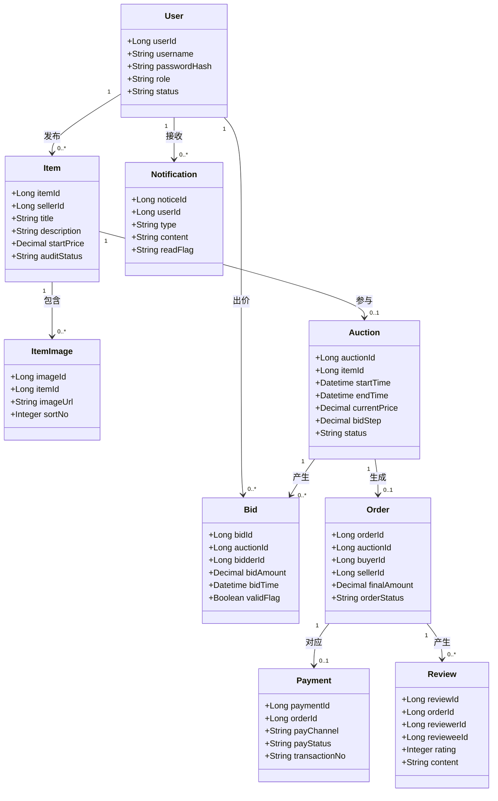
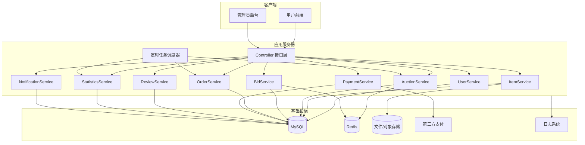
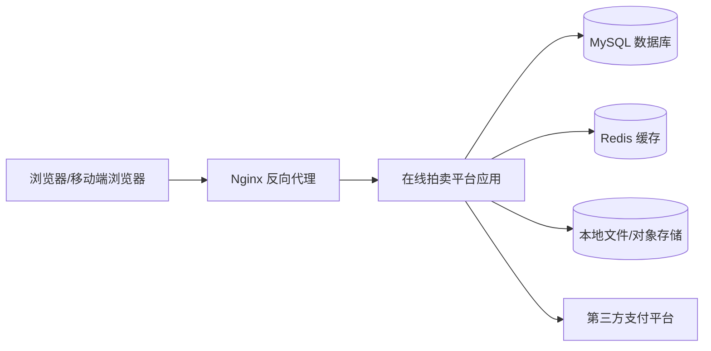
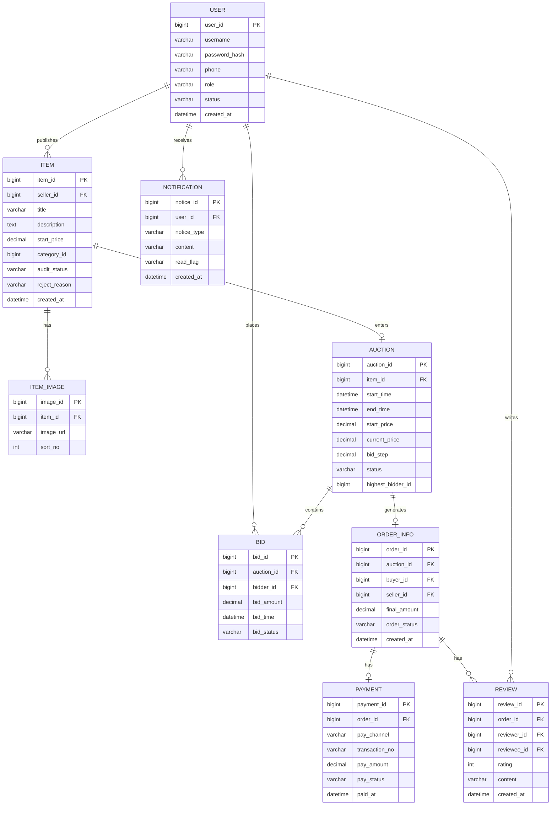

# 在线拍卖平台系统概要设计报告

## 1. 引言

### 1.1 编写目的

本文档用于说明在线拍卖平台的总体架构设计、模块划分、接口定义、数据库结构及出错处理方案，为详细设计、编码实现、系统测试和部署提供依据。

### 1.2 项目背景

在线拍卖平台面向校园或小型社区场景，支持卖家发布拍品、管理员审核与创建拍卖活动、买家参与出价、系统自动判定最高出价者、拍卖结束后进行支付结算及评价反馈。系统采用 Web 架构，强调功能闭环、事务一致性和课程设计可实现性。

### 1.3 相关术语

| 术语 | 定义 |
|---|---|
| 卖家 | 上传拍卖物品并参与交易确认的用户 |
| 买家 | 参与竞价并可能支付购买拍品的用户 |
| 管理员 | 审核物品、创建活动、监控平台运行的角色 |
| 拍卖活动 | 某一时间段内围绕一件拍品进行的竞价过程 |
| 出价 | 买家针对拍卖活动提交的竞价金额 |
| 最高出价者 | 当前有效最高出价的持有人 |
| 保证金 | 可选机制，用于限制恶意出价 |

### 1.4 参考文献

[1] 谭云杰. 大象：Thinking in UML（第3版）[M]. 北京: 机械工业出版社, 2021.  
[2] 张海藩, 牟永敏. 软件工程导论（第6版）[M]. 北京: 清华大学出版社, 2020.  
[3] Martin Fowler. 企业应用架构模式[M]. 北京: 机械工业出版社, 2010.

## 2. 系统体系结构设计

### 2.1 系统特点分析

本系统具有以下特点：

- 业务流程完整，覆盖发布、审核、竞拍、支付、评价全链路。
- 事务型特征明显，核心业务要求状态一致性和数据可追踪性。
- 存在一定实时性要求，出价成功后需快速更新当前最高价并通知用户。
- 既有在线交互处理，也有统计报表、超时关闭订单等批处理任务。
- 适合作为单体分层系统实现，同时预留后续拆分服务的空间。

### 2.2 系统体系结构设计

#### 2.2.1 系统体系结构模式

系统采用“前后端分离 + 分层单体架构”模式：

- 表现层：Web 前端页面、后台管理页面。
- 接口层：RESTful API、WebSocket 推送接口。
- 业务层：用户服务、物品服务、拍卖服务、竞价服务、订单服务、评价服务、统计服务。
- 数据访问层：数据库访问对象、缓存访问组件、文件存储适配器。
- 基础设施层：MySQL、Redis、对象存储、第三方支付、日志与定时任务。

采用该模式的原因如下：

- 适合课程设计规模，开发复杂度可控。
- 分层清晰，便于职责划分与测试。
- 核心业务逻辑可集中管理，便于保证一致性。
- 后续如需演进为微服务，可将竞价、支付、通知等模块逐步拆分。

#### 2.2.2 系统体系结构设计

##### （1）逻辑视图设计



文字说明：

- `User` 为统一用户实体，通过角色字段区分买家、卖家、管理员等身份。
- `Item` 表示卖家发布的拍品基础信息，审核通过后才可参与拍卖。
- `Auction` 负责描述拍卖活动规则及当前竞价状态。
- `Bid` 保存出价历史，是最高价判定和统计分析的重要依据。
- `Order`、`Payment` 共同支撑成交后的支付结算流程。
- `Review` 支撑交易完成后的双向评价。
- `Notification` 负责保存站内通知，支持消息追溯。

##### （2）开发及运行视图设计



文字说明：

- 客户端通过 HTTP/HTTPS 访问系统，部分实时竞价更新可通过 WebSocket 获得。
- `Controller` 层负责请求接收、参数校验和统一响应封装。
- 各 `Service` 负责不同业务域，内部通过清晰接口调用。
- Redis 主要用于缓存热点活动数据、辅助控制并发出价和存储短期通知。
- 定时任务调度器负责拍卖开始/结束检查、超时订单关闭、统计报表生成等批处理任务。

##### （3）部署视图设计



部署说明：

- 课程设计阶段采用单机或两节点部署即可。
- Nginx 负责静态资源转发、反向代理和 HTTPS 入口。
- 应用服务负责全部业务逻辑与接口处理。
- MySQL 持久化核心事务数据，Redis 存放缓存与短期状态。
- 图片等资源可保存在本地磁盘或对象存储。

## 3. 接口设计

### 3.1 外部接口

#### 3.1.1 用户访问接口

| 接口类型 | 路径示例 | 说明 |
|---|---|---|
| HTTP REST | `/api/auth/login` | 用户登录 |
| HTTP REST | `/api/items` | 发布物品、查询物品 |
| HTTP REST | `/api/admin/items/{id}/audit` | 管理员审核物品 |
| HTTP REST | `/api/auctions` | 创建或查询拍卖活动 |
| HTTP REST | `/api/auctions/{id}/bids` | 用户出价 |
| HTTP REST | `/api/orders/{id}/pay` | 发起支付 |
| HTTP REST | `/api/reviews` | 提交评价 |
| WebSocket | `/ws/auction/{id}` | 实时接收价格更新、通知 |

#### 3.1.2 第三方支付接口

| 接口名称 | 方向 | 说明 |
|---|---|---|
| 支付下单接口 | 系统 -> 支付平台 | 创建支付请求，获取支付二维码或支付链接 |
| 支付回调接口 | 支付平台 -> 系统 | 返回支付成功/失败结果 |
| 支付查询接口 | 系统 -> 支付平台 | 对账或补单时主动查询支付状态 |

#### 3.1.3 文件存储接口

| 接口名称 | 说明 |
|---|---|
| 图片上传接口 | 上传拍品图片并返回访问地址 |
| 图片获取接口 | 根据图片地址展示拍品图片 |

### 3.2 内部接口

系统内部模块之间建议采用面向接口的方式组织：

| 内部接口 | 提供者 | 调用者 | 说明 |
|---|---|---|---|
| `IUserService` | 用户服务 | 登录控制器、订单服务 | 用户认证、状态校验、角色查询 |
| `IItemService` | 物品服务 | 前台发布控制器、审核控制器 | 物品保存、查询、审核 |
| `IAuctionService` | 拍卖服务 | 管理后台、定时任务 | 创建活动、切换状态、查询详情 |
| `IBidService` | 竞价服务 | 出价控制器、通知服务 | 校验出价、记录历史、更新最高价 |
| `IOrderService` | 订单服务 | 拍卖服务、支付服务 | 生成订单、状态流转 |
| `IPaymentService` | 支付服务 | 订单控制器、支付回调控制器 | 发起支付、回调处理、幂等校验 |
| `IReviewService` | 评价服务 | 评价控制器 | 提交评价、查询评价 |
| `IStatisticsService` | 统计服务 | 管理后台、定时任务 | 聚合报表、导出统计数据 |
| `INotificationService` | 通知服务 | 竞价服务、订单服务 | 站内信、实时推送 |

### 3.3 关键接口示例

#### 3.3.1 出价接口

请求：

```json
{
  "auctionId": 1001,
  "bidAmount": 260.00
}
```

响应：

```json
{
  "code": 0,
  "message": "success",
  "data": {
    "auctionId": 1001,
    "currentPrice": 260.00,
    "highestBidderId": 2003,
    "bidTime": "2026-04-08 10:30:15"
  }
}
```

错误码约定示例：

| 错误码 | 含义 |
|---|---|
| 0 | 成功 |
| 4001 | 参数非法 |
| 4002 | 拍卖不存在 |
| 4003 | 拍卖未开始或已结束 |
| 4004 | 出价低于最小加价要求 |
| 4005 | 用户无权限出价 |
| 5001 | 系统内部错误 |

#### 3.3.2 审核物品接口

请求：

```json
{
  "itemId": 501,
  "auditStatus": "APPROVED",
  "reason": ""
}
```

#### 3.3.3 支付回调接口

请求字段示例：

```json
{
  "orderId": 9001,
  "transactionNo": "PAY202604080001",
  "payStatus": "SUCCESS",
  "paidAmount": 260.00,
  "sign": "xxxx"
}
```

设计要点：

- 必须校验签名、金额、订单号、支付状态。
- 回调处理需支持幂等。
- 成功后写入支付记录并更新订单状态。

## 4. 系统数据库设计

### 4.1 概念数据库设计

ER 图如下：



实体联系说明：

- 一个用户可以发布多个物品，也可参与多个拍卖活动出价。
- 一个物品在当前设计中最多对应一个拍卖活动。
- 一个拍卖活动可产生多条出价记录，但最终最多生成一条订单。
- 一个订单对应零或一条支付记录，支付成功后进入发货和评价流程。

### 4.2 逻辑数据库设计

#### 4.2.1 主要数据表

| 表名 | 说明 |
|---|---|
| `user` | 用户表 |
| `item` | 物品表 |
| `item_image` | 物品图片表 |
| `category` | 分类表 |
| `item_audit_log` | 物品审核日志表 |
| `auction` | 拍卖活动表 |
| `bid_record` | 出价记录表 |
| `order_info` | 订单表 |
| `payment_record` | 支付记录表 |
| `review` | 评价表 |
| `notification` | 通知表 |
| `statistics_daily` | 日统计表 |

#### 4.2.2 核心表结构设计建议

`user` 表：

| 字段名 | 类型 | 约束 | 说明 |
|---|---|---|---|
| user_id | bigint | PK | 用户编号 |
| username | varchar(50) | unique | 用户名 |
| password_hash | varchar(255) | not null | 密码摘要 |
| phone | varchar(20) |  | 手机号 |
| role | varchar(20) | not null | 用户角色 |
| status | varchar(20) | not null | 用户状态 |
| created_at | datetime | not null | 创建时间 |

`auction` 表：

| 字段名 | 类型 | 约束 | 说明 |
|---|---|---|---|
| auction_id | bigint | PK | 拍卖活动编号 |
| item_id | bigint | FK | 拍品编号 |
| start_time | datetime | not null | 开始时间 |
| end_time | datetime | not null | 结束时间 |
| start_price | decimal(10,2) | not null | 起拍价 |
| current_price | decimal(10,2) | not null | 当前价 |
| bid_step | decimal(10,2) | not null | 最小加价幅度 |
| status | varchar(20) | not null | 活动状态 |
| highest_bidder_id | bigint |  | 最高出价者 |
| extend_seconds | int | default 0 | 延时保护秒数 |

`bid_record` 表：

| 字段名 | 类型 | 约束 | 说明 |
|---|---|---|---|
| bid_id | bigint | PK | 出价编号 |
| auction_id | bigint | FK | 活动编号 |
| bidder_id | bigint | FK | 出价用户编号 |
| bid_amount | decimal(10,2) | not null | 出价金额 |
| bid_time | datetime | not null | 出价时间 |
| bid_status | varchar(20) | not null | 是否有效 |

#### 4.2.3 SQL 建表样例

```sql
CREATE TABLE auction (
  auction_id BIGINT PRIMARY KEY AUTO_INCREMENT,
  item_id BIGINT NOT NULL,
  start_time DATETIME NOT NULL,
  end_time DATETIME NOT NULL,
  start_price DECIMAL(10,2) NOT NULL,
  current_price DECIMAL(10,2) NOT NULL,
  bid_step DECIMAL(10,2) NOT NULL,
  status VARCHAR(20) NOT NULL,
  highest_bidder_id BIGINT NULL,
  extend_seconds INT DEFAULT 0,
  created_at DATETIME NOT NULL,
  updated_at DATETIME NOT NULL
);
```

数据库设计原则：

- 核心事务表采用主键、唯一索引和外键约束保证完整性。
- 高频查询字段如 `auction.status`、`bid_record.auction_id`、`order_info.buyer_id` 应建立索引。
- 审核日志、支付记录、通知记录等采用附属表保留追溯能力。

## 5. 系统出错处理设计

### 5.1 出错信息

| 编号 | 场景 | 输出信息示例 | 含义 | 用户提示方式 |
|---|---|---|---|---|
| E001 | 登录失败 | 用户名或密码错误 | 认证失败 | 表单红字提示 |
| E002 | 图片上传失败 | 图片上传失败，请重试 | 文件服务异常或格式不合法 | 弹窗提示 |
| E003 | 审核驳回 | 审核未通过：描述不完整 | 管理员拒绝发布 | 站内消息+页面状态 |
| E004 | 出价过低 | 当前出价必须不低于 260.00 元 | 不满足最小加价规则 | 详情页即时提示 |
| E005 | 拍卖已结束 | 活动已结束，无法继续出价 | 活动状态已关闭 | 页面提示并刷新状态 |
| E006 | 支付失败 | 支付未成功，请稍后重试 | 支付平台返回失败 | 订单页提示 |
| E007 | 重复回调 | 支付结果已处理，无需重复提交 | 幂等保护生效 | 仅系统日志记录 |
| E008 | 权限不足 | 当前账号无此操作权限 | 角色不匹配 | 错误页/弹窗 |
| E009 | 系统繁忙 | 系统繁忙，请稍后再试 | 服务异常或高负载 | 通用错误提示 |

友好界面设计要求：

- 错误提示应尽量与业务语义一致，避免直接暴露底层异常堆栈。
- 表单类错误尽量在字段附近展示。
- 对于不可恢复错误，应给出返回首页、重试、联系客服等建议操作。

### 5.2 补救措施

针对常见异常，系统补救策略如下：

| 异常类型 | 补救措施 |
|---|---|
| 图片上传失败 | 支持重新上传，保留已填写表单草稿 |
| 出价并发冲突 | 提示当前价格已变化，前端刷新最新价格后允许再次出价 |
| 拍卖结束处理失败 | 定时任务补偿扫描未关闭活动并重新结算 |
| 支付回调丢失 | 通过支付查询接口或人工对账补单 |
| 通知发送失败 | 写入站内消息并记录重试任务 |
| 订单超时未支付 | 定时任务自动关闭订单，并按规则决定是否流拍或重新拍卖 |
| 数据库短时异常 | 接口快速失败并记录日志，待恢复后支持重试 |

## 6. 设计说明补充

### 6.1 关键设计决策

- 采用单体分层架构而非微服务架构，以降低课程设计实现复杂度。
- 核心出价逻辑集中在竞价服务中，避免价格更新分散导致一致性问题。
- 采用状态机思想管理物品、拍卖、订单等核心对象状态。
- 采用定时任务处理活动开始、活动结束、订单超时和统计报表生成。

### 6.2 后续详细设计建议

- 进一步细化接口鉴权流程和统一异常处理机制。
- 输出数据库物理模型和完整建表 SQL。
- 细化各类状态迁移条件和时序控制规则。
- 补充单元测试、集成测试和压力测试设计。

