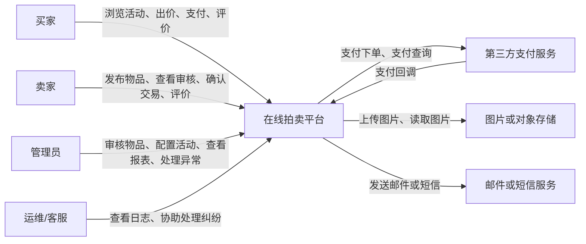
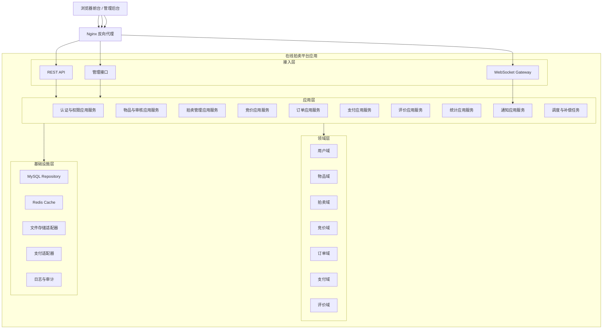
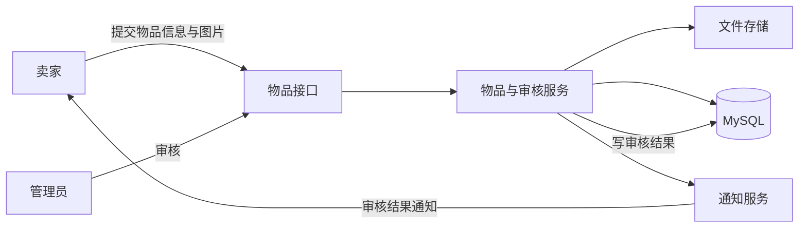
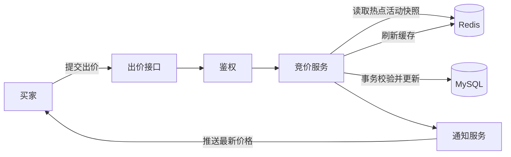
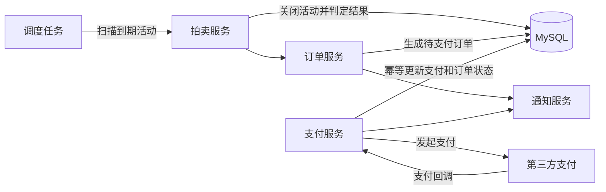
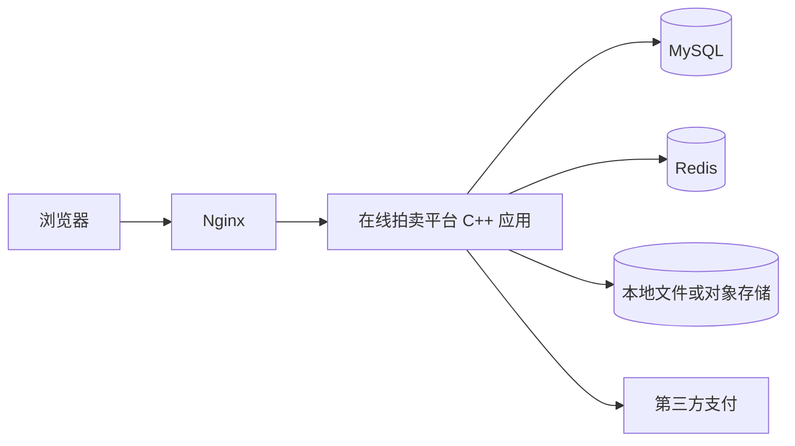
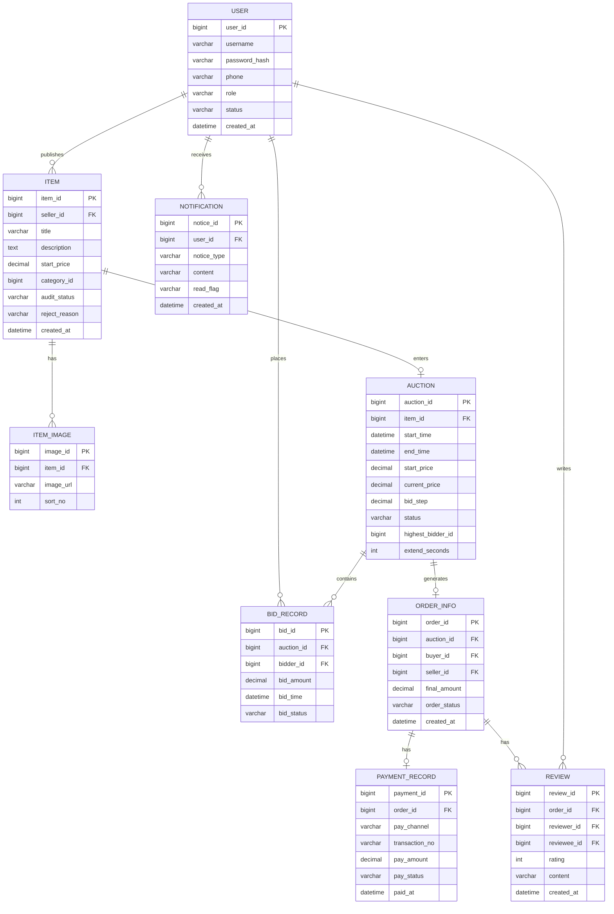

# 在线拍卖平台顶层架构设计说明书

## 1. 引言

### 1.1 编写目的

本文档用于描述在线拍卖平台的顶层架构方案、模块边界、关键业务链路、接口组织方式、数据架构和部署拓扑，为后续详细设计、编码实现、测试验证和课程答辩提供统一的技术基线。

本文档重点回答以下问题：

- 系统为什么选择当前架构风格。
- 系统由哪些核心模块组成，各模块职责如何划分。
- 关键业务链路如何流转，如何保证一致性与可靠性。
- 非功能性需求如何在架构层落地。
- 课程设计阶段如何部署，后续如何平滑演进。

### 1.2 项目背景

在线拍卖平台面向校园或小型社区场景，支持卖家发布拍品、管理员审核、买家竞拍、系统自动结算、买卖双方支付与评价。系统以 Web 方式提供服务，后端采用 C++ 技术栈实现核心业务逻辑，要求具备完整业务闭环、较好的事务一致性以及一定的实时交互能力。

### 1.3 相关术语

| 术语 | 定义 |
|---|---|
| 拍品 | 卖家发布并经审核后参与拍卖的商品 |
| 拍卖活动 | 在规定时间范围内围绕某件拍品进行的竞价过程 |
| 出价 | 买家针对某场拍卖活动提交的竞价金额 |
| 当前最高价 | 当前有效出价中的最高金额 |
| 最高出价者 | 当前持有最高有效出价的用户 |
| 流拍 | 拍卖结束但无人出价或未满足成交条件 |
| 成交订单 | 拍卖结束后由获胜买家与卖家形成的交易记录 |
| 幂等性 | 同一请求重复提交仅产生一次有效状态变更 |
| 延时保护 | 拍卖临近结束时出现有效出价则自动顺延结束时间 |
| 站内通知 | 平台内部保存并推送给用户的消息记录 |

### 1.4 参考文献

[1] 谭云杰. 大象：Thinking in UML（第3版）[M]. 北京: 机械工业出版社, 2021.
[2] 张海藩, 牟永敏. 软件工程导论（第6版）[M]. 北京: 清华大学出版社, 2020.
[3] Martin Fowler. 企业应用架构模式[M]. 北京: 机械工业出版社, 2010.
[4] 需求规格说明书《在线拍卖平台需求规格说明书》.

## 2. 架构驱动因素

### 2.1 业务目标

系统顶层架构围绕以下业务目标展开：

- 支持物品发布、审核、竞拍、支付、评价的完整闭环。
- 保证同一拍卖活动在任一时刻只有一个合法最高价。
- 在课程设计规模下满足较好的响应速度与可验证性。
- 支持管理员进行活动配置、审核管理、异常处理和统计分析。
- 在不引入过高实现复杂度的前提下，为后续扩展预留接口。

### 2.2 关键质量属性

根据需求规格说明书，顶层架构需要重点响应以下质量属性：

| 质量属性 | 架构关注点 | 主要设计手段 |
|---|---|---|
| 性能 | 核心出价链路响应快、通知秒级到达 | Redis 热点缓存、WebSocket 推送、应用内线程池 |
| 一致性 | 最高价、最高出价者、出价记录必须一致 | 数据库事务、行级锁或版本校验、幂等处理 |
| 可靠性 | 通知失败、回调重复、任务失败不破坏主流程 | 补偿任务、日志审计、重试机制、状态机约束 |
| 安全性 | 身份认证、角色鉴权、参数校验、支付验签 | Token 认证、RBAC、输入校验、中间件防护 |
| 可维护性 | 模块边界清晰、职责单一、接口统一 | 分层单体、领域模块化、统一错误码与响应模型 |
| 可扩展性 | 后续可拆分竞价、通知、支付等能力 | 适配器模式、内部接口抽象、异步化边界预留 |

### 2.3 约束条件

本项目存在以下现实约束：

- 课程设计阶段以单机部署或轻量双节点部署为主，不追求工业级大规模集群。
- 后端核心业务采用 C++ 实现，前端通过浏览器访问。
- 系统必须包含数据库持久化设计，并能支持统计类批处理任务。
- 当前优先保证“稳定、完整、可演示”，不引入不必要的复杂基础设施。
- 第三方支付、对象存储、短信邮件属于外部依赖，应通过适配器方式解耦。

### 2.4 关键风险与架构关注点

系统在顶层架构上重点规避以下风险：

- 多用户并发出价导致最高价不一致。
- 拍卖结束瞬间与出价写入发生竞争，造成超时出价被错误接受。
- 支付回调重复或乱序导致订单重复记账。
- 通知、报表、清理等非核心流程阻塞核心交易链路。
- 模块职责不清导致后续详细设计与编码阶段耦合失控。

### 2.5 架构设计原则

为满足上述目标与约束，系统遵循以下设计原则：

1. 核心事务优先：出价、订单、支付状态更新优先保证正确性，再优化性能。
2. 单体内模块化：课程设计阶段采用单体部署，但内部按领域清晰分层。
3. 数据源唯一：MySQL 为交易事实的权威数据源，Redis 仅保存缓存与短期状态。
4. 主链路同步、旁路异步：核心交易流程同步完成，通知、统计、补偿采用异步方式。
5. 状态显式管理：物品、拍卖、订单、支付均采用明确状态机约束。
6. 适配器隔离外部依赖：支付、存储、通知渠道等对外能力统一封装。

## 3. 顶层架构设计

### 3.1 架构风格与总体方案

系统采用“前后端分离 + 模块化分层单体 + 适配器扩展”的总体架构方案。

具体说明如下：

- 前端通过浏览器访问系统，分别提供用户前台页面和管理员后台页面。
- 后端采用单个 C++ 应用统一承载 REST 接口、WebSocket 推送、定时任务与核心业务服务。
- 应用内部按照接入层、应用层、领域层、基础设施层组织代码，而不是将所有逻辑堆在控制器中。
- 外部依赖通过适配器封装，避免支付、对象存储、消息渠道与核心业务强耦合。
- 异步能力优先采用应用内任务调度与数据库任务表，不强制引入消息队列。

选择该方案的原因如下：

- 相比微服务架构，分层单体更适合课程设计规模，开发和调试复杂度低。
- 相比简单 CRUD 结构，该方案能更清晰地表达竞价、支付、结算等复杂业务边界。
- 单体部署可降低部署难度，同时保留后续拆分的演进可能。
- 通过模块边界与适配器抽象，可以兼顾“当前可实现”和“后续可扩展”。

### 3.2 系统上下文与边界

系统上下文图如下：



系统边界说明：

- 平台内部负责用户、拍品、拍卖、出价、订单、支付结果处理、评价、通知、统计等核心业务。
- 支付实际扣款由第三方支付平台负责，本系统只发起支付并处理回调。
- 图片文件由本地文件系统或对象存储承载，系统只保存元数据和访问地址。
- 外部通知渠道可选，站内通知是系统默认可用能力。

### 3.3 分层视图设计

顶层分层视图如下：



各层职责如下：

| 层次 | 主要职责 | 不应承担的职责 |
|---|---|---|
| 接入层 | 协议处理、参数校验、鉴权入口、统一响应封装 | 直接编排复杂业务规则 |
| 应用层 | 编排用例流程、事务边界控制、跨模块协作 | 持久化细节、外部协议细节 |
| 领域层 | 封装核心业务规则、状态变迁、合法性约束 | HTTP 细节、页面展示逻辑 |
| 基础设施层 | 数据库访问、缓存、文件、支付、日志等技术实现 | 决策核心业务规则 |

### 3.4 核心模块划分

系统核心模块划分如下：

| 模块 | 主要职责 | 核心实体 | 关键协作对象 |
|---|---|---|---|
| 认证与权限模块 | 注册登录、身份认证、角色校验、账号状态控制 | User | Order、Admin、Bid |
| 物品与审核模块 | 拍品发布、编辑、图片管理、审核流转 | Item、ItemImage、ItemAuditLog | Storage、Admin |
| 拍卖管理模块 | 创建拍卖活动、状态切换、时间规则管理 | Auction | Item、Bid、Job |
| 竞价模块 | 出价校验、最高价更新、延时保护、竞价历史记录 | Bid、Auction | Redis、Notification |
| 订单模块 | 拍卖结束生成订单、状态流转、超时关闭 | Order | Auction、Payment |
| 支付模块 | 发起支付、处理回调、对账补单、幂等控制 | Payment | Order、PayAdapter |
| 评价模块 | 买卖双方互评、信用数据汇总 | Review | Order、User |
| 通知模块 | 站内信、WebSocket 推送、外部通知扩展 | Notification | Bid、Order、Admin |
| 统计模块 | 日报表、活动统计、成交统计、导出 | StatisticsDaily | Auction、Order、Bid |
| 运维与异常处理模块 | 日志、审计、任务监控、异常恢复 | OperationLog、TaskLog | 全模块 |

### 3.5 模块协作关系

模块协作遵循“核心交易模块聚合，外围能力模块订阅”的思路：

- 认证与权限模块为所有入口模块提供统一身份上下文。
- 物品与审核模块只负责拍品生命周期，不直接处理出价与订单。
- 拍卖管理模块负责活动创建与状态调度，不负责具体竞价规则判断。
- 竞价模块是核心一致性中心，负责最高价、最高出价者、延时保护。
- 订单与支付模块负责交易闭环，不反向修改历史出价记录。
- 通知、统计、运维模块尽量不阻塞主交易链路，以异步或旁路方式消费事件。

### 3.6 关键业务链路设计

#### 3.6.1 物品发布与审核链路



链路要点：

- 物品数据与图片元数据写入数据库，图片本体进入文件存储。
- 审核结果改变物品状态，并记录审核日志。
- 审核通知属于旁路能力，即使通知失败也不回滚审核结果。

#### 3.6.2 竞价链路



链路要点：

- Redis 只用于热点数据快速读取和预检查，不作为最终成交依据。
- 真正的合法性判断与最高价更新在数据库事务中完成。
- 出价成功后再刷新缓存并发送通知，避免缓存先于事实数据更新。

#### 3.6.3 拍卖结束与支付链路



链路要点：

- 拍卖结束由调度任务驱动，不依赖用户主动访问触发。
- 成交订单由拍卖服务调用订单服务统一生成。
- 支付回调必须支持重复通知、乱序到达和补单查询。

### 3.7 数据与状态架构

#### 3.7.1 数据分层原则

系统数据按用途划分为四类：

| 数据类型 | 存储位置 | 说明 |
|---|---|---|
| 交易事实数据 | MySQL | 用户、拍品、拍卖、出价、订单、支付、评价等核心表 |
| 热点缓存数据 | Redis | 热门拍卖当前价、会话、短期通知、统计缓存 |
| 文件数据 | 文件系统或对象存储 | 拍品图片、导出文件 |
| 运维审计数据 | 日志文件与数据库日志表 | 接口日志、任务日志、支付回调日志、审计日志 |

#### 3.7.2 核心状态模型

| 对象 | 关键状态 | 状态说明 |
|---|---|---|
| 物品 | 草稿、待审核、审核通过、审核拒绝、待拍卖、竞拍中、已成交、已流拍、交易完成 | 反映拍品从发布到成交的生命周期 |
| 拍卖活动 | 未开始、竞拍中、已结束、已流拍、已取消 | 反映活动时间窗与业务结果 |
| 订单 | 待支付、已支付、待发货、待收货、已完成、已关闭、已评价 | 反映成交后的履约过程 |
| 支付记录 | 待支付、支付成功、支付失败、已关闭 | 反映资金侧回执状态 |

#### 3.7.3 数据访问策略

- 核心交易表使用 MySQL 事务保证一致性。
- Redis 使用 Cache Aside 模式，写库成功后更新或删除缓存。
- 报表数据可由定时任务聚合写入统计表，避免实时联表过重。
- 通知数据先落库，再推送到 WebSocket，便于失败重试和消息追溯。

### 3.8 一致性与并发控制设计

竞价场景是系统最核心的一致性挑战，顶层架构采用以下策略：

#### 3.8.1 最高价一致性

- `auction` 表中的 `current_price` 与 `highest_bidder_id` 是最高价事实数据。
- 出价成功必须在同一事务内同时完成活动行更新和 `bid_record` 插入。
- 对同一活动的并发出价，采用数据库行级锁或版本号乐观并发控制进行串行化保护。
- 同一拍卖活动在提交事务时再次校验活动状态和结束时间，防止超时写入。

#### 3.8.2 延时保护

- 当有效出价发生在结束前设定时间窗内时，在同一事务中顺延 `end_time`。
- 延时保护只影响活动结束时间，不影响历史出价记录。
- 调度任务在处理结束活动前必须读取最新结束时间，避免与延时出价冲突。

#### 3.8.3 订单与支付幂等

- 订单生成以 `auction_id` 唯一约束保证同一活动最多生成一个订单。
- 支付回调以 `transaction_no` 和业务幂等键约束重复处理。
- 同一订单支付成功后，后续重复成功回调只记录日志，不重复更新状态。

#### 3.8.4 异步与补偿

- 通知发送失败不影响主业务提交，失败记录进入重试任务。
- 拍卖结束处理失败时，调度任务按照活动状态和结束时间重扫补偿。
- 支付回调失败或丢失时，可由主动查询接口或人工对账任务补单。

### 3.9 安全与权限架构

系统安全设计包含以下内容：

- 采用基于 Token 的身份认证机制，前后端分离场景下便于统一鉴权。
- 采用 RBAC 角色控制，至少区分普通用户、管理员、运维/客服。
- 所有写操作接口进行登录校验、角色校验和参数合法性校验。
- 出价接口增加频率限制、防重放标识和金额校验。
- 密码仅保存安全哈希摘要，不保存明文。
- 支付回调必须校验签名、金额、订单号、商户号和状态。
- 管理操作、审核操作、支付处理保留审计日志。

### 3.10 可观测性与运维架构

为支持调试、答辩演示和异常定位，系统至少应具备以下运维能力：

| 能力 | 设计方式 | 用途 |
|---|---|---|
| 业务日志 | 统一结构化日志 | 追踪登录、审核、出价、支付等关键操作 |
| 审计日志 | 管理操作日志表 | 记录敏感操作与责任主体 |
| 任务日志 | 调度任务执行记录 | 排查结算失败、报表失败、补偿失败 |
| 指标监控 | 接口耗时、错误数、活动数、出价数 | 观察系统健康度 |
| 告警入口 | 日志扫描或监控阈值 | 提示异常活动、支付回调失败等问题 |

### 3.11 部署拓扑设计

课程设计阶段建议采用如下部署拓扑：



部署说明：

- Nginx 提供静态资源分发、反向代理、TLS 入口和基础限流能力。
- 应用服务统一提供 REST、WebSocket 和调度任务能力。
- MySQL 保存所有核心交易数据。
- Redis 保存热点数据、登录态和短期消息。
- 图片可优先存放在本地磁盘，后续再切换到对象存储。

### 3.12 演进路线

系统演进建议如下：

1. 第一阶段：单体部署，完成全部核心业务闭环。
2. 第二阶段：抽离通知、报表和对账等异步能力，减少对核心链路影响。
3. 第三阶段：当竞价并发明显提高时，独立拆分竞价服务和活动调度服务。
4. 第四阶段：按访问压力决定是否对读侧、文件侧、统计侧做进一步扩展。

## 4. 接口架构设计

### 4.1 对外接口分类

| 接口类型 | 路径示例 | 作用 |
|---|---|---|
| REST | `/api/auth/login` | 登录认证 |
| REST | `/api/items` | 发布、修改、查询拍品 |
| REST | `/api/admin/items/{id}/audit` | 审核拍品 |
| REST | `/api/auctions` | 创建、查询拍卖活动 |
| REST | `/api/auctions/{id}/bids` | 提交出价 |
| REST | `/api/orders/{id}/pay` | 发起支付 |
| REST | `/api/payments/callback` | 接收支付回调 |
| REST | `/api/reviews` | 提交评价 |
| REST | `/api/admin/statistics/daily` | 查看日报表 |
| WebSocket | `/ws/auction/{id}` | 订阅活动价格与状态变更 |

### 4.2 内部服务接口

系统内部建议以接口抽象形式组织模块协作：

| 内部接口 | 提供模块 | 调用方 | 说明 |
|---|---|---|---|
| `IAuthService` | 认证与权限模块 | 全部入口控制器 | 用户认证、角色校验、账号状态校验 |
| `IItemService` | 物品与审核模块 | 前台物品控制器、审核控制器 | 拍品保存、查询、审核流转 |
| `IAuctionService` | 拍卖管理模块 | 管理后台、调度任务 | 创建活动、查询活动、切换状态 |
| `IBidService` | 竞价模块 | 出价控制器、通知模块 | 出价校验、写入记录、更新最高价 |
| `IOrderService` | 订单模块 | 拍卖模块、支付模块 | 生成订单、关闭订单、状态流转 |
| `IPaymentService` | 支付模块 | 订单控制器、回调控制器 | 发起支付、处理回调、对账补单 |
| `IReviewService` | 评价模块 | 评价控制器 | 提交评价、查询评价 |
| `INotificationService` | 通知模块 | 竞价、订单、审核模块 | 站内信、推送、外部通知扩展 |
| `IStatisticsService` | 统计模块 | 管理后台、调度任务 | 报表聚合、统计导出 |

### 4.3 接口统一规范

#### 4.3.1 统一响应模型

建议所有 REST 接口统一响应结构：

```json
{
  "code": 0,
  "message": "success",
  "data": {}
}
```

#### 4.3.2 统一错误码原则

| 错误码范围 | 含义 |
|---|---|
| `0` | 成功 |
| `4xxx` | 业务或参数错误 |
| `5xxx` | 系统内部错误 |

推荐关键错误码：

| 错误码 | 说明 |
|---|---|
| 4001 | 参数非法 |
| 4002 | 资源不存在 |
| 4003 | 状态不允许当前操作 |
| 4004 | 权限不足 |
| 4005 | 出价金额不合法 |
| 4006 | 支付回调校验失败 |
| 5001 | 内部服务异常 |
| 5002 | 外部依赖不可用 |

#### 4.3.3 鉴权与幂等规范

- 需要登录的接口必须携带 Token。
- 管理接口除登录外还需检查管理员角色。
- 支付回调接口和订单相关写接口应支持幂等键或唯一约束。
- 管理员审核、订单关闭、任务重试等操作应写审计日志。

### 4.4 关键接口示例

#### 4.4.1 出价接口

请求：

```json
{
  "auctionId": 1001,
  "bidAmount": 260.00
}
```

响应：

```json
{
  "code": 0,
  "message": "success",
  "data": {
    "auctionId": 1001,
    "currentPrice": 260.00,
    "highestBidderId": 2003,
    "endTime": "2026-04-08 21:30:15"
  }
}
```

#### 4.4.2 审核物品接口

请求：

```json
{
  "itemId": 501,
  "auditStatus": "APPROVED",
  "reason": ""
}
```

#### 4.4.3 支付回调接口

请求字段示例：

```json
{
  "orderId": 9001,
  "transactionNo": "PAY202604080001",
  "payStatus": "SUCCESS",
  "paidAmount": 260.00,
  "sign": "xxxx"
}
```

处理要求：

- 校验签名、金额、订单号、商户号和支付状态。
- 以唯一流水号保证回调幂等。
- 支付成功后更新支付记录，并驱动订单状态变更。

## 5. 数据架构设计

### 5.1 概念模型

ER 模型如下：



### 5.2 核心数据表

| 表名 | 说明 |
|---|---|
| `user` | 用户基础信息 |
| `item` | 拍品基础信息 |
| `item_image` | 拍品图片 |
| `item_audit_log` | 拍品审核日志 |
| `auction` | 拍卖活动 |
| `bid_record` | 出价历史记录 |
| `order_info` | 成交订单 |
| `payment_record` | 支付记录 |
| `review` | 评价记录 |
| `notification` | 站内通知 |
| `statistics_daily` | 日汇总统计 |
| `task_log` | 调度与补偿任务记录 |

### 5.3 核心表字段建议

`user` 表：

| 字段名 | 类型 | 约束 | 说明 |
|---|---|---|---|
| user_id | bigint | PK | 用户编号 |
| username | varchar(50) | unique | 用户名 |
| password_hash | varchar(255) | not null | 密码摘要 |
| phone | varchar(20) |  | 手机号 |
| role | varchar(20) | not null | 用户角色 |
| status | varchar(20) | not null | 用户状态 |
| created_at | datetime | not null | 创建时间 |

`auction` 表：

| 字段名 | 类型 | 约束 | 说明 |
|---|---|---|---|
| auction_id | bigint | PK | 活动编号 |
| item_id | bigint | FK | 拍品编号 |
| start_time | datetime | not null | 开始时间 |
| end_time | datetime | not null | 结束时间 |
| start_price | decimal(10,2) | not null | 起拍价 |
| current_price | decimal(10,2) | not null | 当前价 |
| bid_step | decimal(10,2) | not null | 最小加价幅度 |
| status | varchar(20) | not null | 活动状态 |
| highest_bidder_id | bigint |  | 当前最高出价者 |
| extend_seconds | int | default 0 | 延时保护秒数 |
| version | bigint | default 0 | 并发控制版本号 |

`bid_record` 表：

| 字段名 | 类型 | 约束 | 说明 |
|---|---|---|---|
| bid_id | bigint | PK | 出价编号 |
| auction_id | bigint | FK | 活动编号 |
| bidder_id | bigint | FK | 出价用户编号 |
| bid_amount | decimal(10,2) | not null | 出价金额 |
| bid_time | datetime | not null | 出价时间 |
| bid_status | varchar(20) | not null | 出价状态 |

`order_info` 表：

| 字段名 | 类型 | 约束 | 说明 |
|---|---|---|---|
| order_id | bigint | PK | 订单编号 |
| auction_id | bigint | unique | 拍卖活动编号 |
| buyer_id | bigint | FK | 买家编号 |
| seller_id | bigint | FK | 卖家编号 |
| final_amount | decimal(10,2) | not null | 成交金额 |
| order_status | varchar(20) | not null | 订单状态 |
| created_at | datetime | not null | 创建时间 |

`payment_record` 表：

| 字段名 | 类型 | 约束 | 说明 |
|---|---|---|---|
| payment_id | bigint | PK | 支付记录编号 |
| order_id | bigint | FK | 订单编号 |
| transaction_no | varchar(64) | unique | 第三方支付流水号 |
| pay_channel | varchar(20) | not null | 支付渠道 |
| pay_amount | decimal(10,2) | not null | 支付金额 |
| pay_status | varchar(20) | not null | 支付状态 |
| paid_at | datetime |  | 支付完成时间 |

### 5.4 索引与缓存设计建议

#### 5.4.1 索引建议

- `auction(status, end_time)`：支持活动调度扫描。
- `bid_record(auction_id, bid_time)`：支持活动出价历史查询。
- `order_info(buyer_id, order_status)`：支持买家订单列表查询。
- `payment_record(transaction_no)`：支持回调幂等和流水查询。
- `notification(user_id, read_flag, created_at)`：支持用户消息中心查询。

#### 5.4.2 Redis Key 建议

| Key 模式 | 用途 |
|---|---|
| `session:user:{userId}` | 登录态或用户会话 |
| `auction:detail:{auctionId}` | 活动详情缓存 |
| `auction:price:{auctionId}` | 当前价和最高出价者缓存 |
| `auction:countdown:{auctionId}` | 剩余时间或延时保护辅助信息 |
| `stats:daily:{yyyyMMdd}` | 日报表热点缓存 |

### 5.5 数据生命周期说明

- 出价记录、订单记录、支付记录属于长期保留的交易凭据。
- 通知记录可按课程设计需要定期归档或保留最近若干月。
- 统计日报表由定时任务汇总生成，作为管理端快速查询数据源。
- 日志文件和任务日志建议按日期滚动，便于演示和排障。

## 6. 异常、补偿与降级设计

### 6.1 异常分类

| 异常类别 | 典型场景 | 处理原则 |
|---|---|---|
| 参数类异常 | 参数缺失、金额格式错误 | 快速失败，直接返回明确提示 |
| 状态类异常 | 拍卖未开始、拍卖已结束、订单已关闭 | 不重试，提示当前状态 |
| 并发类异常 | 当前价格已变化、出价冲突 | 返回最新价格，引导用户重试 |
| 外部依赖异常 | 支付平台超时、存储不可用 | 隔离失败范围，记录日志并补偿 |
| 系统内部异常 | 数据库暂时不可用、线程池繁忙 | 统一异常处理并告警 |

### 6.2 关键补偿策略

| 异常类型 | 补救措施 |
|---|---|
| 出价并发冲突 | 返回最新当前价，前端刷新后允许再次出价 |
| 拍卖结束任务失败 | 调度任务按结束时间和状态重扫补偿 |
| 支付回调失败 | 记录回调日志并支持主动查询补单 |
| 通知发送失败 | 落库后重试，必要时仅保留站内信 |
| 统计任务失败 | 记录任务日志，支持按日期重跑 |
| 图片上传失败 | 保留表单草稿，允许重新上传 |

### 6.3 降级策略

| 故障场景 | 降级方式 |
|---|---|
| Redis 不可用 | 读请求回退 MySQL，核心交易继续但性能下降 |
| WebSocket 不可用 | 前端改为轮询获取最新价格与状态 |
| 外部通知不可用 | 仅保留站内信，不阻塞审核或交易主流程 |
| 对象存储不可用 | 暂停图片上传，不影响已存在活动浏览与竞价 |

## 7. 架构决策与落地建议

### 7.1 关键架构决策

| 决策点 | 选型 | 原因 |
|---|---|---|
| 系统形态 | 分层单体 | 课程设计规模可控，便于实现与调试 |
| 核心一致性中心 | MySQL 事务 | 规则清晰，便于保证最高价正确性 |
| 高速读模型 | Redis 缓存 | 提升热点活动读取与通知效率 |
| 异步能力 | 应用内任务加数据库任务表 | 不额外引入 MQ，复杂度低 |
| 外部依赖接入 | 适配器模式 | 便于更换支付、存储、通知渠道 |
| 认证授权 | Token 加 RBAC | 适配前后端分离场景 |

### 7.2 推荐开发顺序

建议按以下顺序落地实现：

1. 用户认证与权限管理。
2. 物品发布、审核、图片管理。
3. 拍卖活动管理与状态调度。
4. 核心竞价链路与最高价一致性控制。
5. 订单生成、支付回调和幂等处理。
6. 通知、评价、统计、运维与补偿任务。

### 7.3 后续详细设计输出建议

后续进入详细设计阶段时，建议继续产出以下内容：

- 各模块类图、包图和时序图。
- 完整数据库物理模型与建表 SQL。
- 统一异常处理、中间件和日志规范。
- 出价链路的事务边界、锁策略和性能测试方案。
- 支付、通知、文件存储适配器的详细接口契约。
