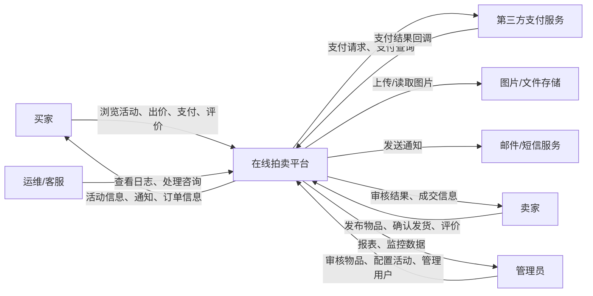
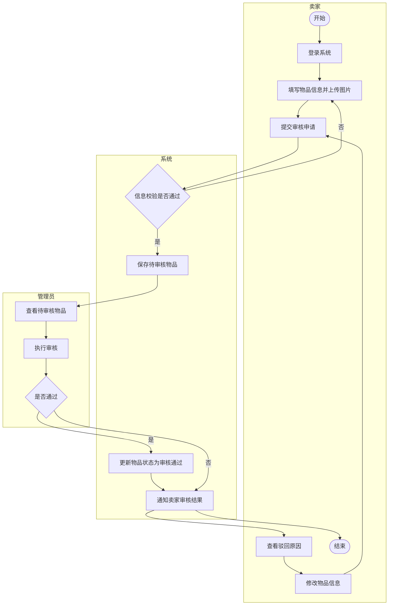
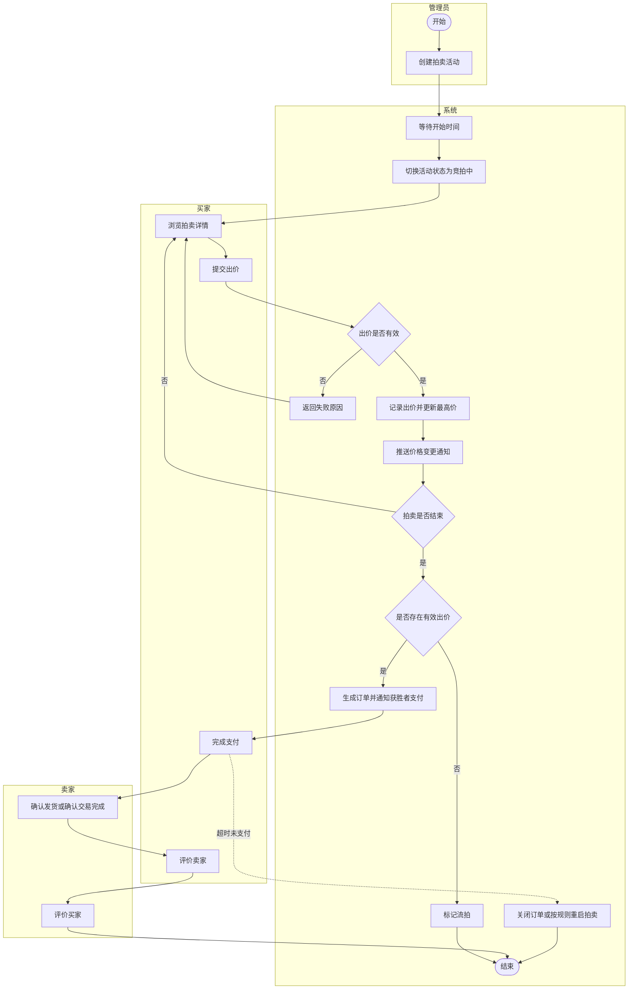
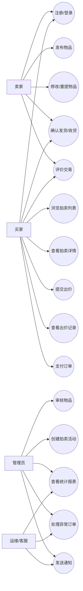
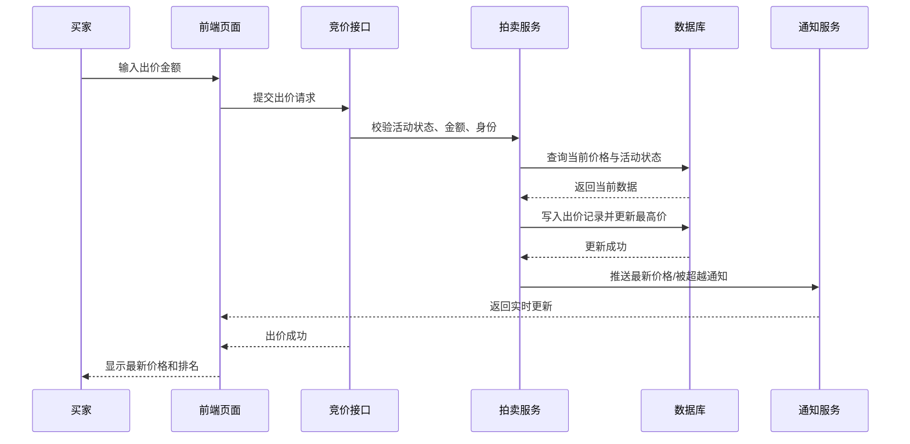
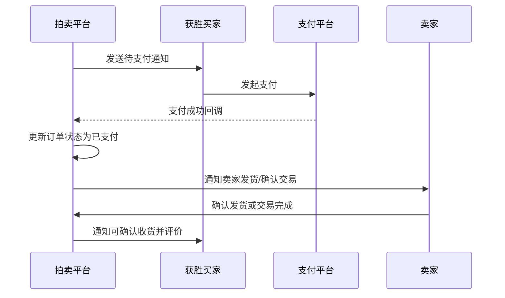
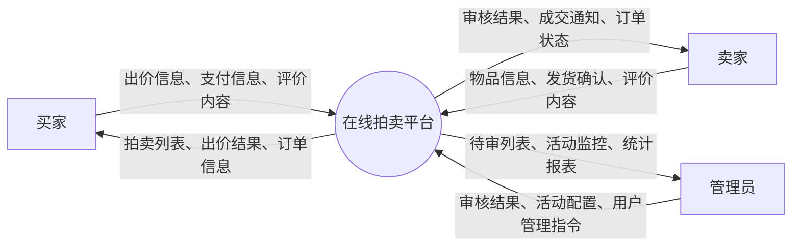
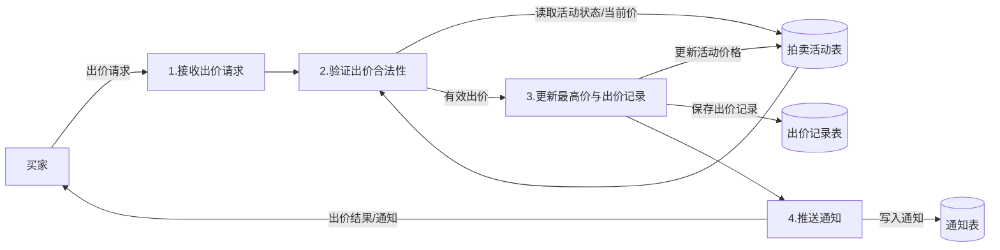
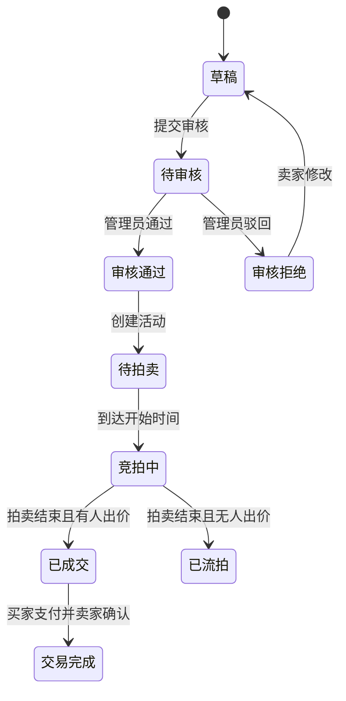
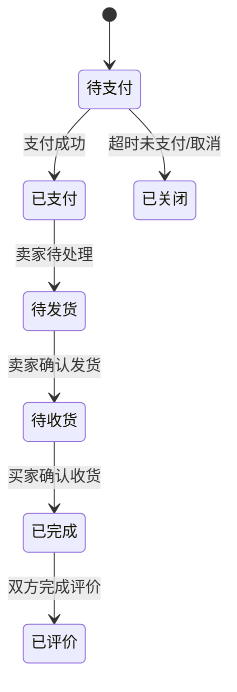

# 在线拍卖平台需求规格说明书

## 1. 概述

### 1.1 背景

随着互联网交易方式从静态展示逐步演进为动态竞价，在线拍卖系统已成为二手商品流通、校园闲置置换、限量商品分配的重要支撑平台。传统线下拍卖存在参与门槛高、时空限制强、信息不透明、处理效率低等问题；而通用型电商平台虽然支持交易，但往往缺乏规范的竞价机制、拍卖活动管理能力和完整的成交结算闭环。

本项目拟设计并实现一个基于 Web 的在线拍卖平台，面向校园或小型社区场景，提供物品发布、管理员审核、拍卖活动配置、实时竞价、支付结算、评价反馈、统计分析等功能。系统后端采用 C++ 技术栈实现核心业务逻辑，前端采用浏览器访问模式，以满足课程设计对交互式事务处理系统、数据库应用和批处理统计功能的要求。

在技术目标上，系统重点关注以下问题：

- 多用户同时出价时的并发控制与最高价一致性。
- 拍卖结束时的状态切换、成交判定与支付流转。
- 活动统计、通知提醒、评价反馈等业务闭环。
- 系统的可维护性、可扩展性与课程设计可落地性。

需要说明的是，课程设计阶段以“稳定、完整、可验证”为优先目标。对于高性能拍卖引擎、延时保护、并发控制等内容，本说明书将给出合理的工程目标与实现约束，但不以工业级超大规模集群指标作为验收前提。

### 1.2 编写目标

本文档用于明确在线拍卖平台的软件需求，为系统设计、编码、测试和部署提供依据，具体目标如下：

- 明确系统业务范围、系统边界和用户角色职责。
- 采用 UML 对核心业务流程、用例关系和状态变化进行建模。
- 规范系统的功能性需求与非功能性需求。
- 为后续概要设计、数据库设计、接口设计和测试设计提供输入。
- 为项目组成员、指导教师和评审人员提供统一的需求理解基础。

### 1.3 相关术语定义

| 术语 | 英文 | 定义 |
|---|---|---|
| 拍卖活动 | Auction | 在规定时间范围内针对某件拍品组织的竞价过程，包含起拍价、加价幅度、开始时间、结束时间等规则。 |
| 拍品 | Item | 卖家发布并经过管理员审核后可参与拍卖的商品。 |
| 出价 | Bid | 买家针对某场拍卖活动提交的竞价金额。 |
| 当前最高价 | Current Highest Price | 某拍卖活动当前有效出价中的最大值。 |
| 最高出价者 | Highest Bidder | 当前持有最高有效出价的用户。 |
| 流拍 | Unsold | 拍卖结束后无人出价，或满足规则但未成交的状态。 |
| 成交订单 | Order | 拍卖结束后由获胜买家与卖家形成的交易记录。 |
| 幂等性 | Idempotency | 同一请求重复提交时，系统仅产生一次有效状态变更。 |
| 延时保护 | Anti-sniping | 在拍卖临近结束时，若出现有效出价，则自动顺延若干秒，防止恶意抢拍。 |
| 实时通知 | Realtime Notification | 系统通过站内消息、WebSocket 或轮询方式推送价格变化、拍卖结束、支付提醒等信息。 |

### 1.4 参考资料

[1] 谭云杰. 大象：Thinking in UML（第3版）[M]. 北京: 机械工业出版社, 2021.  
[2] 张海藩, 牟永敏. 软件工程导论（第6版）[M]. 北京: 清华大学出版社, 2020.  
[3] Ian Sommerville. 软件工程（原书第10版）[M]. 北京: 机械工业出版社, 2017.  
[4] Martin Fowler. 企业应用架构模式[M]. 北京: 机械工业出版社, 2010.  
[5] 西南交通大学计算机与人工智能学院. 本科毕业设计论文的格式要求[EB/OL], 2023.

## 2. 总体要求

### 2.1 现状及痛点

当前拍卖相关业务在校园和小型社区中常见以下问题：

- 物品发布渠道分散，缺少统一审核机制。
- 竞价过程依赖聊天群或人工记录，缺少价格实时更新与历史追踪。
- 拍卖结束后的获胜者确认、支付和交易完成缺少规范流程。
- 管理员无法方便地监控活动、统计数据和处理异常情况。
- 用户难以通过评价体系判断交易对象信用。

因此，需要设计一套轻量化、功能完整、易于维护的在线拍卖平台，覆盖物品从发布、审核、竞拍到结算评价的全流程。

### 2.2 系统目标

- 提供物品发布、修改、下架与图片展示功能。
- 提供管理员审核机制，确保拍品信息合法、完整。
- 支持拍卖活动创建、规则配置、开始/结束控制和状态监控。
- 支持买家浏览活动、查看详情、实时出价和历史出价查询。
- 支持拍卖结束后的成交确认、支付结算与交易完成流程。
- 支持评价反馈、统计分析、通知提醒和后台管理。

### 2.3 用户及角色分析

#### 2.3.1 普通用户

普通用户在平台中可根据场景扮演卖家和买家两种身份。

作为卖家时，主要职责包括：

- 发布物品信息并上传图片。
- 查看物品审核状态与驳回原因。
- 查看拍卖进度与成交状态。
- 在买家支付后确认发货或确认线下交易完成。
- 对交易完成后的买家进行评价。

作为买家时，主要职责包括：

- 浏览拍卖列表、搜索拍品并查看详情。
- 在拍卖有效期内出价并关注当前最高价变化。
- 在获胜后完成支付。
- 确认收货或确认交易完成。
- 对卖家进行评价。

#### 2.3.2 管理员

管理员负责平台规则执行与核心业务管理，主要职责包括：

- 审核卖家提交的物品，决定通过或驳回。
- 创建拍卖活动并配置时间、起拍价、加价幅度、延时规则等参数。
- 监控活动状态、出价情况和交易进度。
- 管理用户状态、处理违规行为和异常订单。
- 查看统计报表并维护系统基础配置。

#### 2.3.3 运维/客服

运维/客服具备受限权限，主要职责包括：

- 查看系统运行状态和日志。
- 查询交易、支付和出价记录以协助处理纠纷。
- 向用户发送通知或反馈处理结果。
- 标记异常交易并提交管理员进一步处理。

### 2.4 系统边界及上下文环境

系统边界说明如下：

- 本系统负责用户、物品、拍卖、出价、订单、评价、统计等核心业务逻辑。
- 第三方支付服务由外部系统提供，本系统通过接口完成支付发起和回调处理。
- 图片存储可采用本地文件系统或对象存储服务。
- 邮件/短信服务属于外部通知渠道，可替换为站内消息。

系统上下文图如下：

## 3. 功能性需求

### 3.1 系统功能模块划分

系统至少包含以下 8 个业务功能模块：

1. 用户与权限管理模块
2. 物品发布与审核模块
3. 拍卖活动管理模块
4. 竞价与实时通知模块
5. 订单与支付结算模块
6. 评价与反馈模块
7. 统计分析与报表模块
8. 系统监控与异常处理模块

### 3.2 主业务流程分析

#### 3.2.1 主流程一：物品发布与审核流程

业务描述：

1. 卖家登录系统并进入物品发布页面。
2. 卖家填写标题、描述、分类、起拍价、图片等信息并提交。
3. 系统校验字段合法性，保存为“待审核”状态。
4. 管理员查看待审核物品并进行审核。
5. 若审核通过，物品状态改为“审核通过”，可用于创建拍卖活动。
6. 若审核不通过，系统记录驳回原因并通知卖家修改后重新提交。

活动图如下：

#### 3.2.2 主流程二：竞拍与成交流程

业务描述：

1. 管理员从审核通过的物品中创建拍卖活动。
2. 系统在开始时间到达后自动将活动状态切换为“竞拍中”。
3. 买家浏览拍卖详情并提交出价。
4. 系统校验出价时间、用户状态、金额合法性和加价幅度。
5. 若出价有效，则更新当前最高价、最高出价者及出价历史，并推送最新价格。
6. 活动结束后，系统自动锁定最高出价者，生成订单。
7. 获胜买家在规定时间内支付，卖家确认发货或交易完成。
8. 双方在交易完成后互评。

活动图如下：

### 3.3 用例分析

#### 3.3.1 总体用例图

#### 3.3.2 关键用例说明

**用例名称：发布物品**

- 参与者：卖家、管理员
- 前置条件：卖家已登录
- 后置条件：物品处于“待审核”或“审核通过”状态
- 基本流程：
  1. 卖家填写物品信息并上传图片。
  2. 系统进行合法性校验并保存数据。
  3. 管理员审核物品。
  4. 审核通过后，物品进入待拍卖池。
- 异常流程：
  1. 图片上传失败，提示重新上传。
  2. 字段不完整或非法，提示修正。
  3. 审核不通过，记录原因并允许重新提交。

**用例名称：出价竞拍**

- 参与者：买家、系统
- 前置条件：买家已登录，拍卖活动处于“竞拍中”
- 后置条件：产生一条有效出价记录，或返回失败原因
- 基本流程：
  1. 买家进入拍卖详情页。
  2. 买家输入出价金额并提交。
  3. 系统校验出价时间、金额、用户资格。
  4. 系统更新最高价与最高出价者。
  5. 系统推送最新价格和通知。
- 异常流程：
  1. 出价金额不满足最小加价幅度。
  2. 活动已结束或已暂停。
  3. 并发冲突导致当前价格已变化。
  4. 用户被冻结或未满足支付条件。

**用例名称：支付结算**

- 参与者：买家、卖家、系统、第三方支付服务
- 前置条件：拍卖已结束且订单已生成
- 后置条件：订单状态变为“已支付”“待发货”或“已关闭”
- 基本流程：
  1. 系统通知获胜买家支付。
  2. 买家在支付时限内发起支付。
  3. 支付平台回调系统支付结果。
  4. 系统更新订单状态并通知卖家。
  5. 卖家确认发货或交易完成。
- 异常流程：
  1. 支付失败或超时。
  2. 支付回调重复到达。
  3. 卖家未及时确认发货。

### 3.4 时序分析

#### 3.4.1 竞价时序图

#### 3.4.2 支付结算时序图

### 3.5 数据流分析

#### 3.5.1 顶层数据流图

#### 3.5.2 一层数据流图：竞拍处理

#### 3.5.3 数据字典

| 数据流名称 | 简述 | 来源 | 去向 | 组成 |
|---|---|---|---|---|
| 出价请求 | 买家提交的竞价请求 | 买家 | 出价验证模块 | 出价编号、用户编号、活动编号、出价金额、出价时间 |
| 审核结果 | 管理员对拍品的审核结论 | 管理员 | 物品管理模块/卖家 | 物品编号、审核状态、审核意见、审核时间 |
| 拍卖活动信息 | 向用户展示的活动数据 | 拍卖管理模块 | 买家/卖家 | 活动编号、标题、起拍价、当前价、开始时间、结束时间、状态 |
| 支付回调 | 第三方支付返回的处理结果 | 支付平台 | 订单模块 | 订单编号、支付流水号、支付状态、回调时间 |
| 评价信息 | 买卖双方提交的评分与评论 | 买家/卖家 | 评价模块 | 订单编号、评分、评论内容、评价时间 |
| 统计报表 | 平台汇总后的业务统计信息 | 统计模块 | 管理员 | 活动数量、成交量、流拍量、出价次数、成交金额 |

### 3.6 状态模型

#### 3.6.1 物品状态图

#### 3.6.2 订单状态图

## 4. 非功能性需求

### 4.1 性能需求

结合课程设计规模与可实现性，系统性能目标定义如下：

- 普通页面请求平均响应时间不高于 2 秒。
- 核心出价接口在单机实验环境下的平均响应时间不高于 500ms，P95 不高于 1 秒。
- 支持至少 200 个并发在线用户进行浏览与出价测试。
- 支持活动列表、统计数据的定时汇总和批处理生成。
- 实时通知在常规局域网/校园网环境下具备秒级可达能力。

### 4.2 数据一致性需求

- 同一拍卖活动在任一时刻只能存在一个当前最高价。
- 出价写入、最高价更新和最高出价者更新必须处于同一事务或受一致性机制保护。
- 支付回调处理应具备幂等性，重复回调不得产生重复记账。
- 活动结束后不得再接受新的有效出价。
- 订单状态迁移必须遵循既定状态机，不允许越级跳转。

### 4.3 安全性需求

- 用户密码采用安全哈希算法存储，不得明文保存。
- 重要接口需进行身份认证与权限控制。
- 关键表单输入需防范 SQL 注入、XSS、CSRF 等常见攻击。
- 出价接口需进行频率限制与参数校验，防止恶意刷价。
- 支付相关接口需校验签名、金额与订单号的一致性。

### 4.4 可靠性需求

- 系统出现单条出价失败时不得影响其他活动正常运行。
- 当通知服务不可用时，应允许主交易流程继续，并补偿发送站内消息。
- 当支付回调短时失败时，系统应支持重试或人工补单。
- 定时任务失败后应保留日志并支持再次执行。

### 4.5 可维护性与可扩展性需求

- 系统按模块化方式设计，至少分离用户、拍卖、订单、评价、统计等服务层。
- 对外接口应统一采用明确的请求/响应结构与错误码规范。
- 关键业务日志应具备可追踪性，便于调试和审计。
- 预留第三方支付、对象存储和消息通知的适配接口。
- 后续可扩展为分布式部署，但课程设计阶段先采用单体架构加清晰分层实现。

### 4.6 易用性需求

- 卖家发布物品流程应控制在 3 至 5 步内完成。
- 买家应能清晰看到当前价、剩余时间、自己的出价状态。
- 管理员应具备待审核列表、活动状态看板和统计视图。
- 所有关键错误提示应明确说明原因并给出可执行建议。

## 5. 约束条件

- 系统类型为基于 Web 的交互式事务处理系统。
- 系统必须包含数据库持久化设计，并支持统计类批处理功能。
- 系统核心业务模块不少于 6 个，主业务流程不少于 2 个。
- 课程设计实现应以单机部署、功能完整、文档齐全、测试可复现为目标。

## 6. 验收要点

- 能完成用户注册登录、物品发布、管理员审核、活动创建、用户出价、成交支付、评价反馈的完整业务闭环。
- 用例流程与 UML 图、数据库设计、接口设计保持一致。
- 关键状态变化可追踪，关键数据可查询。
- 对异常流程有明确处理策略，如审核驳回、支付超时、重复回调、非法出价等。
