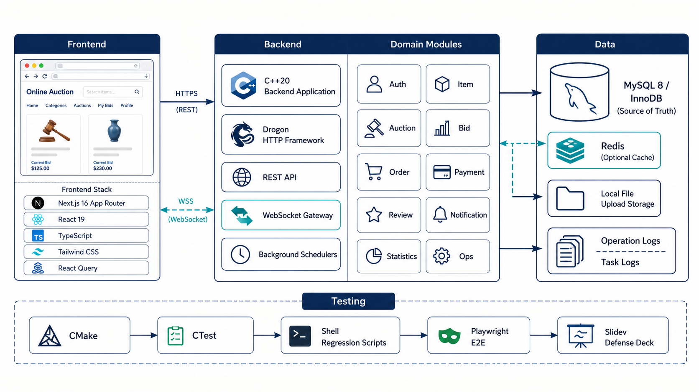
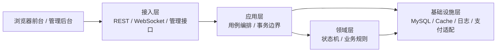
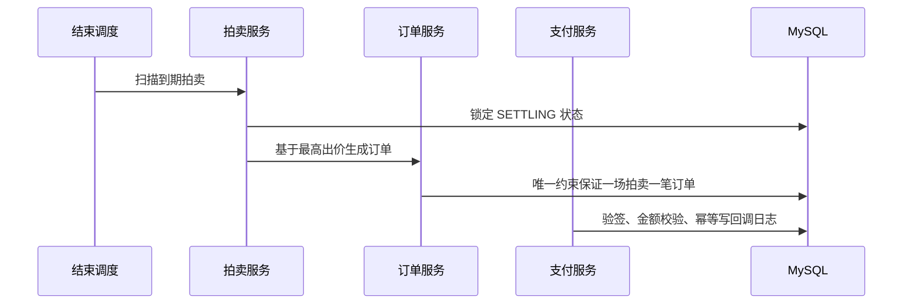

<style>
:root {
  --font-serif: "Noto Serif SC", "Source Han Serif SC", "Source Serif 4", "Songti SC", SimSun, Georgia, serif;
  --slidev-theme-font-mono: "JetBrains Mono", "Fira Code", "SF Mono", "Cascadia Code", monospace;
}
.slidev-layout {
  font-family: "Noto Sans SC", "Source Han Sans SC", "Microsoft YaHei", "PingFang SC", "Hiragino Sans GB", "Inter", system-ui, sans-serif;
  letter-spacing: 0;
}
.slidev-layout h1,
.slidev-layout h2,
.slidev-layout h3 {
  font-family: "Noto Serif SC", "Source Han Serif SC", "Source Serif 4", "Songti SC", SimSun, Georgia, serif;
  font-weight: 700;
  letter-spacing: 0;
}
.slidev-layout p,
.slidev-layout li,
.slidev-layout table,
.slidev-layout blockquote,
.slidev-layout strong,
.slidev-layout div {
  letter-spacing: 0;
}
.slidev-layout code,
.slidev-layout pre {
  font-family: var(--slidev-theme-font-mono);
}
.slidev-layout .story-box,
.slidev-layout .story-box * {
  font-family: "Noto Sans SC", "Source Han Sans SC", "Microsoft YaHei", "PingFang SC", "Inter", system-ui, sans-serif;
}
.slidev-layout .story-box h3 {
  font-family: "Noto Serif SC", "Source Han Serif SC", "Source Serif 4", "Songti SC", SimSun, Georgia, serif;
}
.defense-hero {
  position: absolute;
  inset: 96px 48px 48px;
  opacity: 0.94;
  pointer-events: none;
}
.defense-hero img {
  width: 100%;
  height: 100%;
  object-fit: contain;
}
.metric-grid {
  display: grid;
  grid-template-columns: repeat(3, minmax(0, 1fr));
  gap: 14px;
  margin-top: 18px;
}
.metric-card {
  border: 1px solid #d9d7cf;
  background: rgba(255,255,255,0.82);
  border-radius: 8px;
  padding: 16px 18px;
}
.metric-card strong {
  display: block;
  color: #1e3a5f;
  font-size: 24px;
  line-height: 1.1;
  margin-bottom: 8px;
}
.compact-table table {
  font-size: 0.82rem;
}
.small-note {
  color: #6b7280;
  font-size: 0.72rem;
}
.flow-steps {
  display: grid;
  grid-template-columns: repeat(5, minmax(0, 1fr));
  gap: 10px;
  margin-top: 18px;
}
.flow-steps div {
  min-height: 92px;
  border: 1px solid #d9d7cf;
  border-radius: 8px;
  background: rgba(255,255,255,0.84);
  padding: 12px;
}
.flow-steps strong {
  color: #1e3a5f;
  display: block;
  margin-bottom: 8px;
}
.tech-arch {
  display: grid;
  grid-template-columns: 1.05fr 1.1fr 0.95fr;
  gap: 14px;
  margin-top: 14px;
}
.tech-col {
  border: 1px solid #d9d7cf;
  background: rgba(255,255,255,0.9);
  border-radius: 8px;
  padding: 14px;
  min-height: 378px;
}
.tech-col h3 {
  color: #1e3a5f;
  font-size: 1.05rem;
  margin: 0 0 10px;
}
.tech-box {
  border: 1px solid #d9d7cf;
  border-left: 4px solid #1e3a5f;
  border-radius: 8px;
  padding: 10px 12px;
  margin-bottom: 10px;
  background: #fcfcfa;
}
.tech-box strong {
  display: block;
  color: #1a1f2b;
  margin-bottom: 4px;
}
.tech-box span {
  color: #3f4654;
  font-size: 0.76rem;
  line-height: 1.35;
}
.tech-arrow {
  text-align: center;
  color: #1e3a5f;
  font-weight: 700;
  margin: 4px 0 10px;
}
.arch-stack-image {
  width: 100%;
  height: 72vh;
  object-fit: contain;
  border: 1px solid #d9d7cf;
  border-radius: 8px;
  background: #fcfcfa;
}
</style>

---
layout: cover
---

> Software Engineering Course Design · 2026

# 在线拍卖平台

课程设计小组 · 答辩汇报

---
layout: statement
---

# 用 C++ 实现一个可演示、可验证的在线拍卖交易闭环

从拍品发布、管理员审核、实时竞价，到订单支付、履约评价、统计运维，系统把“聊天群式拍卖”的人工记录变成了可追踪的 Web 事务系统。

---
layout: default
---

# 需求背景：解决小型社区拍卖的四类问题

<div class="metric-grid">
  <div class="metric-card">
    <strong>信息分散</strong>
    拍品发布、审核与展示没有统一入口，人工沟通成本高。
  </div>
  <div class="metric-card">
    <strong>竞价不透明</strong>
    当前最高价、最高出价者和历史记录难以实时确认。
  </div>
  <div class="metric-card">
    <strong>结算断裂</strong>
    拍卖结束后的订单、支付、履约和评价缺少标准流程。
  </div>
</div>

<StoryBox title="课程设计边界" variant="insight">
  项目面向校园或小型社区场景，目标不是工业级大规模集群，而是稳定、完整、可验证、可现场演示。
</StoryBox>

---
layout: two-cols
divider: true
leftLabel: 用户角色
rightLabel: 功能模块
---

::left::

# 角色边界

- 普通用户：同时可作为卖家和买家
- 管理员：审核拍品、配置拍卖、查看统计与异常
- 运维/客服：查看日志、辅助处理交易争议

<StoryBox title="核心闭环" variant="tip">
  卖家发布、管理员审核、买家竞价、系统结算、双方履约评价。
</StoryBox>

::right::

# 模块划分

- 用户与权限管理
- 物品发布与审核
- 拍卖活动管理
- 竞价与实时通知
- 订单与支付结算
- 评价与反馈
- 统计分析与报表
- 系统监控与异常处理

---
layout: default
---

# 总体架构：模块化单体 + 真实业务前端



<div class="small-note">核心口径：`frontend/` 真实前端 + C++20/Drogon 后端 + MySQL 8 事实源 + HTTP/WS 接入 + 自动化验证闭环。</div>

---
layout: default
---

# 分层设计：控制协议复杂度，保留业务一致性



<div class="metric-grid">
  <div class="metric-card"><strong>接入层</strong>参数校验、鉴权入口、统一响应。</div>
  <div class="metric-card"><strong>应用层</strong>组织用例流程，明确事务边界。</div>
  <div class="metric-card"><strong>领域层</strong>封装竞价、结算、支付等核心规则。</div>
</div>

---
layout: default
---

# 数据模型：状态机驱动交易事实

<div class="compact-table">

| 领域对象 | 物理表 | 答辩关注点 |
|---|---|---|
| User | `user_account` | 角色、账号状态、登录安全 |
| Item | `item` / `item_image` / `item_audit_log` | 发布、图片、审核轨迹 |
| Auction | `auction` | 当前价、最高出价者、状态、版本 |
| Bid | `bid_record` | 出价历史、幂等键、有效性 |
| Order | `order_info` | 一场拍卖最多一笔订单 |
| Payment | `payment_record` / `payment_callback_log` | 回调验签、金额校验、幂等 |
| Ops | `notification` / `task_log` / `operation_log` | 通知、调度、审计 |

</div>

<Footnote>设计口径：金额使用 `decimal(12,2)`，交易事实统一落 MySQL；Redis 只作旁路缓存。</Footnote>

---
layout: default
---

# 竞价一致性：同一时刻只有一个合法最高价

<div class="defense-hero">
  
</div>

<div style="position:relative; max-width: 55%;">

- 出价前校验登录、角色、账号状态、拍卖状态、时间和金额
- 出价记录、当前价、最高出价者和延时保护在同一事务内生效
- 拍卖结束边界在提交路径内二次检查，阻止晚到出价
- 缓存刷新失败不回滚交易事实，后续可从 MySQL 恢复

</div>

---
layout: default
---

# 订单与支付：本地测试支付模型，但按真实链路约束



<StoryBox title="支付边界" variant="warning">
  当前没有接入真实第三方支付平台；前端传 `confirm_success=true` 触发后端本地 mock 成功回调，用于完整演示订单支付闭环。
</StoryBox>

---
layout: default
---

# 前端实现：真实业务工作台，而不是静态演示页

<div class="compact-table">

| 页面 | 路由 | 展示能力 |
|---|---|---|
| 公共门户 | `/` | 活动入口、搜索、运行中拍卖 |
| 拍卖大厅 | `/auction/hall` | URL 驱动筛选、活动列表 |
| 竞价详情 | `/auction/detail/[id]` | 真实出价、历史、WebSocket/轮询 |
| 拍品发布 | `/auction/publish` | 发布向导、图片 URL 校验、提交审核 |
| 我的订单 | `/orders` / `/checkout/[orderId]` | 支付、发货、收货、评价 |
| 管理大盘 | `/admin/dashboard` | 审核、建拍、统计、运维日志 |

</div>

<div class="small-note">当前主入口：`frontend/`，默认地址 `http://127.0.0.1:3000`。</div>

---
layout: default
---

# 真实接口接入：HTTP + WebSocket 全链路

<div class="metric-grid">
  <div class="metric-card">
    <strong>Auth / Item</strong>
    登录、会话恢复、拍品发布、图片元数据、提交审核、下架。
  </div>
  <div class="metric-card">
    <strong>Auction / Bid</strong>
    公开列表、详情、建拍、出价历史、提交出价、实时价格。
  </div>
  <div class="metric-card">
    <strong>Order / Ops</strong>
    支付、发货、收货、评价、通知、统计日报、操作日志。
  </div>
</div>

```text
HTTP: /api/...
WS:   /ws/auction/{id}
```

---
layout: default
---

# 答辩演示流程：围绕一件拍品走完闭环

<div class="defense-hero">
  
</div>

<div class="flow-steps" style="position:relative;">
  <div><strong>发布</strong>卖家提交拍品、图片和建议竞价配置</div>
  <div><strong>审核</strong>管理员批准拍品并创建短时拍卖</div>
  <div><strong>竞价</strong>两名买家先后出价，刷新权威最高价</div>
  <div><strong>支付</strong>中标者进入订单并完成本地测试支付</div>
  <div><strong>评价</strong>卖家发货、买家收货、完成评价和通知</div>
</div>

---
layout: default
---

# 高风险验证：针对交易系统最容易出错的位置

<div class="compact-table">

| 风险点 | 验证方式 | 结果 |
|---|---|---|
| 并发出价最高价一致性 | 12 个买家并发相同金额出价 | 通过 |
| 拍卖结束竞争 | 结束调度与晚到出价并发 | 通过 |
| 结算竞争 | 4 个任务并发扫描同一拍卖 | 通过 |
| 支付回调幂等 | 6 个相同成功回调并发到达 | 通过 |
| 缓存降级 | 模拟缓存刷新失败 | 通过 |
| 通知失败 | 失败通知持久化并可重试 | 通过 |
| 安全负向 | 未认证、越权、冻结、坏签名 | 通过 |

</div>

---
layout: fact
---

# 18 / 18

全量 `ctest --test-dir build --output-on-failure` 通过

<div class="metric-grid">
  <div class="metric-card"><strong>HTTP</strong>`scripts/test.sh http` 覆盖真实业务接口</div>
  <div class="metric-card"><strong>Risk</strong>`scripts/test.sh risk` 覆盖并发与幂等</div>
  <div class="metric-card"><strong>E2E</strong>`defense-flow.spec.ts` 覆盖浏览器答辩链路</div>
</div>

---
layout: default
---

# 部署与验收入口

```bash
./start.sh --config config/app.local.json
```

- 默认启动后端 `http://127.0.0.1:18080`
- 默认启动前端 `http://127.0.0.1:3000`
- 数据库不可用时自动尝试本地 MySQL fallback
- 发布验证入口：`scripts/deploy/verify_release.sh`

<StoryBox title="答辩口径" variant="warning">
  历史 `/demo` 只读展示台和旧 `/app` 页面不作为当前主验收入口；当前主入口是 `frontend/` + 真实 HTTP/WS。
</StoryBox>

---
layout: end
---

# 谢谢

演示入口：`http://127.0.0.1:3000`

验证入口：`scripts/deploy/verify_release.sh`

Q&A
